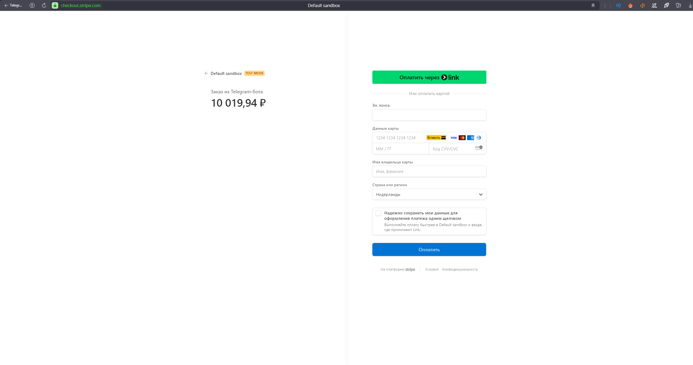

# Тестовое задание: Бэкенд и Telegram-бот для интернет-магазина


Этот проект — тестовое задание, включающее бэкенд на Django с REST API и фронтенд в виде Telegram-бота на Aiogram 3.x. Бэкенд предоставляет каталог товаров, FAQ, управление заказами и профили пользователей с функцией рассылки сообщений через Telegram. Telegram-бот взаимодействует с бэкендом для просмотра каталога, управления корзиной и доступа к FAQ.

---

## Структура проекта

```

.
├── LICENSE                # Лицензия MIT
├── Server/                # Бэкенд (Django RF)
│   ├── Dockerfile         # Конфигурация Docker для бэкенда
│   ├── docker-compose.yml # Docker Compose для сервисов бэкенда
│   ├── poetry.lock        # Файл зависимостей Poetry
│   ├── pyproject.toml     # Конфигурация Poetry
│   └── server/            # Корень Django-проекта
│       ├── catalog/       # Приложение для каталога товаров
│       ├── config/        # Настройки Django
│       ├── faq/           # Приложение FAQ
│       ├── manage.py      # Скрипт управления Django
│       ├── media/         # Загруженные медиафайлы
│       ├── order/         # Приложение для управления заказами
│       ├── static/        # Статические файлы (изображения)
│       ├── staticfiles/   # Собранные статические файлы
│       ├── user/          # Приложение для профилей пользователей и рассылки
│       └── utils/         # Утилиты (например, отправка сообщений в Telegram)
├── TelegramBot/           # Фронтенд (Telegram-бот)
│   ├── Dockerfile         # Конфигурация Docker для бота
│   ├── docker-compose.yml # Docker Compose для сервисов бота
│   ├── config.py          # Конфигурация бота
│   ├── handlers/          # Обработчики команд Telegram
│   ├── infrastructure/    # HTTP-клиент для взаимодействия с API
│   ├── logs/              # Логи бота
│   ├── main.py            # Точка входа бота
│   ├── models/            # Модели данных
│   ├── poetry.lock        # Файл зависимостей Poetry
│   ├── pyproject.toml     # Конфигурация Poetry
│   ├── reports/           # Сгенерированные отчёты (orders.xlsx)
│   ├── repositories/      # Слой доступа к данным
│   ├── requirements.txt   # Альтернативный список зависимостей
│   ├── services/          # Бизнес-логика
│   └── utils/             # Утилиты
└── start-services.sh      # Скрипт для запуска всех сервисов
```

---

## Функциональность

### Бэкенд (Server)
- **Каталог**: Управление категориями, подкатегориями и товарами через REST API (`/api/catalog/`).
- **FAQ**: Управление часто задаваемыми вопросами (`/api/faq/`).
- **Заказы**: Создание и отслеживание заказов с поддержкой оплаты (`/api/order/`).
- **Профили пользователей**: Хранение данных пользователей, включая Telegram ID (`/admin/user/userprofile/`).
- **Рассылка**: Отправка сообщений выбранным пользователям через Telegram из админ-панели.
- **Оплата**: Обработка вебхуков Stripe для подтверждения платежей (`/webhooks/stripe/`).
- **Технологии**: Django 5.0, Django REST Framework, PostgreSQL, Docker.

### Фронтенд (Telegram-бот)
- **Просмотр каталога**: Отображение товаров из бэкенда.
- **Управление корзиной**: Добавление/удаление товаров и оформление заказов с оплатой через Stripe.
- **Доступ к FAQ**: Получение ответов на частые вопросы.
- **Технологии**: Python 3.12, Aiogram 3.x, Docker.


---

## Требования

- [Docker](https://www.docker.com/get-started) и [Docker Compose](https://docs.docker.com/compose/install/)
- [Poetry](https://python-poetry.org/docs/#installation) (опционально, для локальной разработки)
- Токен Telegram-бота (получите у [@BotFather](https://t.me/BotFather))
- Аккаунт Stripe и ключи API для тестирования оплаты (регистрация на [Stripe Dashboard](https://dashboard.stripe.com/register))
- [ngrok](https://ngrok.com/) для локального тестирования вебхуков Stripe
---

## Установка и запуск

### 1. Клонирование репозитория

```bash
git clone https://github.com/Corner324/TA_TelegramBot.git
cd TA_TelegramBot
```

### 2. Настройка переменных окружения

Создайте файл `.env` в директории `Server/` со следующим содержимым:

```env
# Настройки бэкенда
SECRET_KEY=ваш-ключ-для-django
DEBUG=True
TELEGRAM_BOT_TOKEN=токен-telegram-бота
BACKEND_DATABASE_NAME=temp_db
BACKEND_DATABASE_USER=temp_user
BACKEND_DATABASE_PASSWORD=temp_password
BACKEND_DATABASE_HOST=db
BACKEND_DATABASE_PORT=5432
```

Замените `токен-telegram-бота` на токен от @BotFather и настройте параметры базы данных при необходимости.

### 3. Запуск сервисов

Запустите бэкенд и Telegram-бот с помощью скрипта:

```bash
chmod +x start-services.sh
./start-services.sh
```

Скрипт:

- Собирает и запускает бэкенд (`Server`) и Telegram-бот (`TelegramBot`) через Docker Compose.
- Применяет миграции и собирает статические файлы для бэкенда.
- Запускает сервисы в фоновом режиме.

---

## Использование

### Бэкенд

- **Админ-панель**: Доступна по адресу `http://localhost:8000/admin/` (создайте суперпользователя для входа).
- **Рассылка сообщений**:
  1. Перейдите в раздел `Профили пользователей` в админ-панели.
  2. Выберите пользователей, поставив галочки.
  3. Выберите действие "Отправить сообщение выбранным пользователям" из выпадающего списка.
  4. Введите сообщение (например, "Привет, это тест!") и нажмите "Отправить".
  5. Сообщения будут отправлены пользователям с указанными Telegram ID.
- **API-эндпоинты**:
  - Каталог: `GET /api/catalog/`
  - FAQ: `GET /api/faq/`
  - Заказы: `POST /api/order/`

### Telegram-бот

- Запустите бота, отправив ему сообщение в Telegram (например, `/start`).
- Команды:
  - `/catalog` — Просмотр товаров.
  - `/cart` — Просмотр корзины.
  - `/faq` — Доступ к FAQ.
- Бот взаимодействует с API бэкенда для получения данных.

---

## Разработка

### Локальный запуск (без Docker)

1. **Бэкенд**:
   ```bash
   cd Server/
   poetry install
   poetry run python server/manage.py migrate
   poetry run python server/manage.py runserver
   ```
2. **Telegram-бот**:
   ```bash
   cd TelegramBot/
   poetry install
   poetry run python main.py
   ```

### Создание суперпользователя

```bash
cd Server/
docker-compose exec backend_api python server/manage.py createsuperuser
```

### Загрузка тестовых данных
Для заполнения каталога тестовыми данными используйте фикстуры, они загружаются через скрипт:
load-fixtures.sh

Это добавит категории, подкатегории и товары в базу данных.

---

## Подробности структуры файлов
- **Server/**:
  - `catalog/` — Управление товарами.
  - `faq/` — FAQ.
  - `order/` — Заказы.
  - `user/` — Профили и рассылка.
  - `webhooks/` — Обработка платежей Stripe.
  - `utils/` — Утилиты.
- **TelegramBot/**:
  - `handlers/` — Обработчики команд.
  - `services/` — Бизнес-логика.
  - `repositories/` — Доступ к данным.

---

## Настройка оплаты через Stripe
Оплата через Stripe работает только в тестовом режиме и требует:
1. **Локальный HTTPS**: Запустить ngrok для создания публичного HTTPS-URL:
   ```bash
   ngrok http 8000
   ```
   Пример: `https://cbb2-46-151-31-7.ngrok-free.app`.

2. **Настройка вебхука в Stripe**:
   - В [Stripe Dashboard](https://dashboard.stripe.com/test/webhooks) добавьте вебхук с URL вида `https://ваш-ngrok-url.ngrok-free.app/webhooks/stripe/`.
   - Событие: `checkout.session.completed`.
   - Скопируйте `Signing Secret` в `.env` как `STRIPE_WEBHOOK_SECRET`.

3. **Тестирование**:
   - Оплата не работает "из коробки". Для проверки используйте свой аккаунт Stripe, подставив свои ключи в `.env`.


